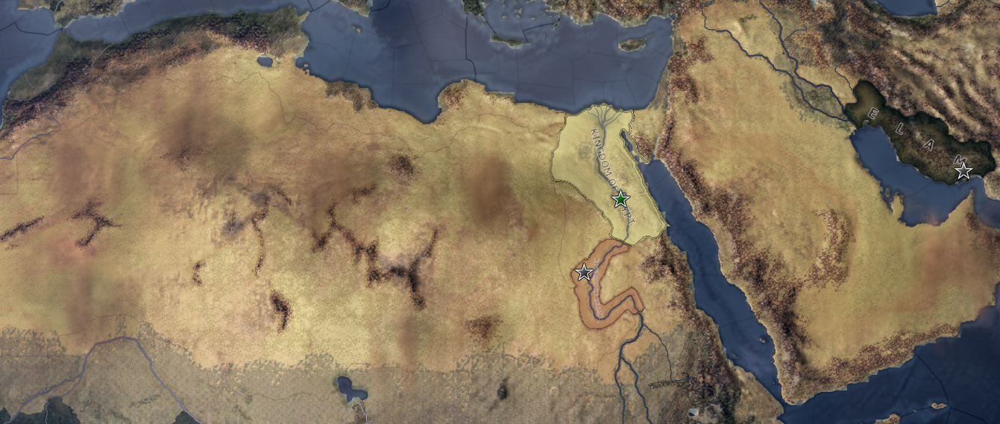
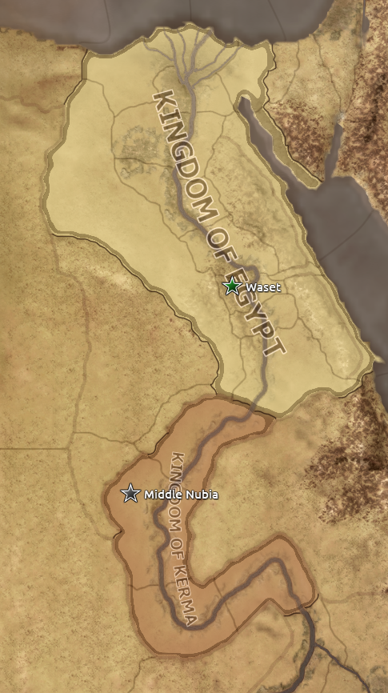
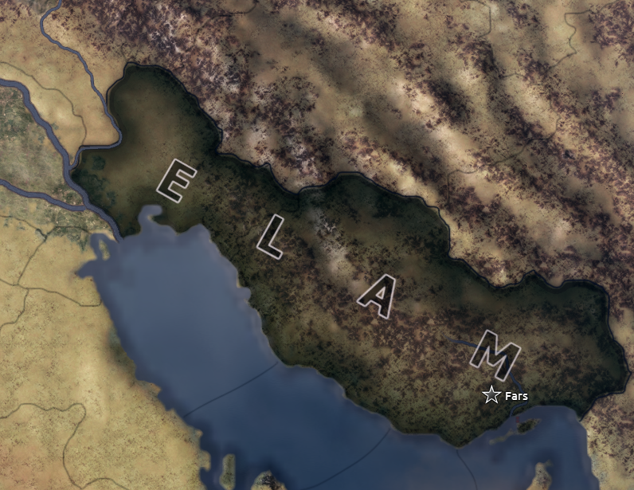

# Hoi4 - Middle Kingdom Mod

Middle Kingdom is a mod for the video game Hearts of Iron IV. In an attempt to push the limitations of the game engine, and because I personally take interest in ancient history, this mod takes place from 2010 - 1995 BC. The main focus of the mod is the middle kingdom of Egypt and its neighbours - some of the first civilizations in the world. Players can choose to contest the balance of power in Mesopotamia, or attempt to profit off trade along the North African trade routes. The Middle Kingdom mod aims to be lightweight by only having a few playable civilizations. What it lacks in terms of options is hopefully made up for with the inclusion of alernative paths for each civilization to take. To prevent the campaign from going on for too long, some historical timelines will be shifted to better fit within the window of the campaign. Further, some events from years before or after this mod's scope may be introduced within the campaign to keep things interesting. A lot of research has gone into this mod, however some liberties will be taken both because of historical uncertainties and to keep the mod entertaining.

## Egypt

The Middle Kingdom of Egypt, as it stands around 2010 BC, has recently been reunified by Mentuhotep II. Threats from both east and south still remain. Egypt is nothing without control of the Nile. Will you seek to expand your control southward, marching your armies upstreams to Kerma's borders? Or will you stand in solidarity, and fight off foreign invaders together? While the wast Sahara offers protection from the west, the Nile delta remains difficult to defend. There are rumors from the east of a great empire. Without a regular standing army, only you can decide the fate of Egypt.

## Elam

A storm is brewing in Mesopotamia. Elam has long quarreled for control on the southern banks of the Tigris and Eufrates. While the vast Sumerian empire stretches from the Mediterranean basin to the Persian gulf, Elam has been pushed out of Susa. This great Elamite city laying under foreign control is a dagger in the side of Kindattu. While they may have occupied the city, Sumer too was weakened by the strife. For the future of Elam Kindattu must return this dagger to its Mesopotamian owners. This Goliat must be felled!

